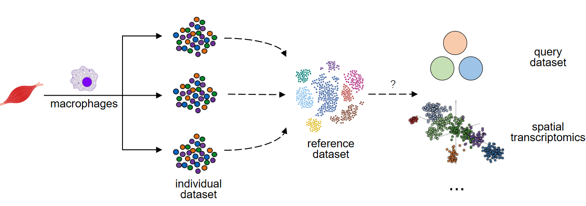

# MuscleMacrophages
We aim to construct general framework for muscle-specific macrophage classification based on single-cell RNA sequencing analysis. This will help to understand the association between macrophages and skeletal muscle homeostasis in context of aging and exercise.

## Data source
We construct a candidate list with a systematic literature search for skeletal muscle-associated single cell(nucleus) analyses. 
We primarily focusing on the relationship between macrophages, exercise, and aging, yet we also complement our analysis by including control samples from acute injury and muscular dystrophy studies. 
Based on that, scRNAseq datasets of FACS-sorted macrophages are favored most since they allow relatively high sequencing depth and macrophage abundance. Some atlas datasets are also employed to ensure enough dataset size.
Dataset list can be found at [dataset_link.txt](dataset_link.txt)

## Analysis pipeline
We plan to build a reference dataset of muscle macrophages by integrating several datasets, and test for its ability of generalization. Detailed analysis methods will be explained in [Analysis_plan.md](Analysis_plan.md) and associated script files.
